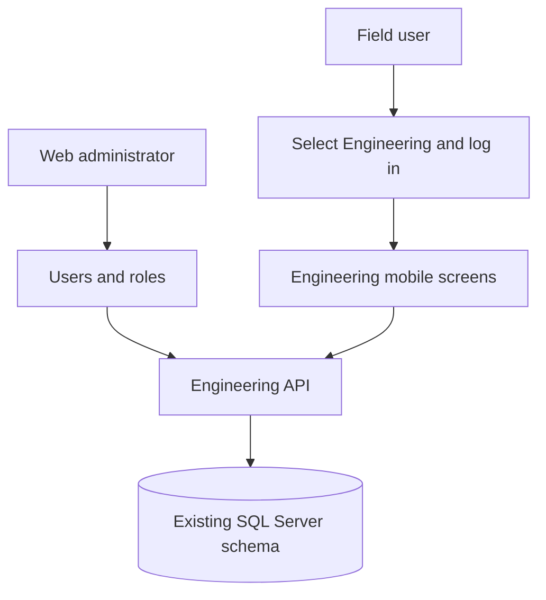
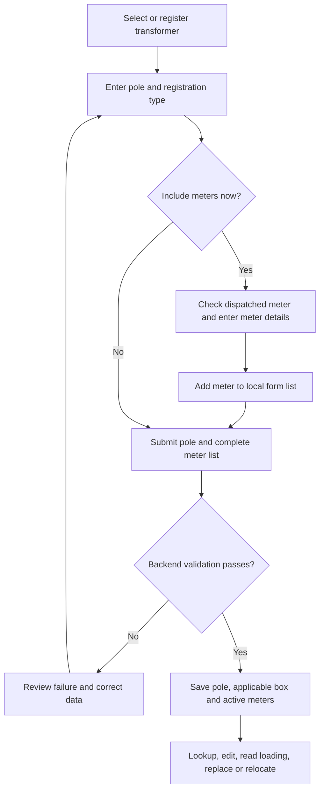

# JEDCO Engineering Process Flow

Reviewed on 30 September 2026 against the three local source repositories. This document explains the supporting Engineering user and role administration.

The main engineering process is: configure user access, register a transformer, register its poles and meters, then maintain readings, meter references, box allocations, replacements, and relocations. The mobile app performs field work; the current web application manages users and roles. Successful field submissions normally write directly to the backend. No supervisor approval queue was found in the Engineering workflows reviewed.

## 1. Scope and system responsibilities

| Source | Responsibility | Boundary |
| --- | --- | --- |
| `jedco-engineering-spring` in `/home/mirt/IdeaProjects/` | Engineering API, access control, asset and meter records, history, SQL Server persistence | Also serves a compiled web distribution; its parity with the separate web checkout was not established |
| `jedco-engineering-web` in `/home/mirt/VSCodeProjects/` | React login, users, and user roles | Active authenticated routes are `/users` and `/roles` |
| `jedco-field-ops` in `/home/mirt/StudioProjects/` | Engineering module of the Android Flutter app | Engineering login, asset registration, loading readings, and meter operations |

The flows below cover the Engineering module and its supporting web administration. They describe source behavior, not a live deployment test.

## 2. Access and session flow

### Engineering login

1. The web user enters credentials, or the mobile user selects **Engineering** and enters credentials.
2. The client sends `POST /Engineering/auth` with `username` and `password`.
3. The backend authenticates the account and returns `status`, `message`, `token`, `name` (the user's first name), and `authorities`.
4. On success, subsequent authenticated requests carry a Bearer token. Authorities determine the available client actions and protected backend methods.
5. On failure, the client displays the response message and remains at login.

The web app stores login state in MobX memory; a page refresh clears it. Its idle logout action is commented out. The mobile app persists the token, selected module, and authorities in GetStorage. At startup it checks the stored token through its JWT validity helper; a valid stored Engineering session opens the Engineering home screen, otherwise login is required.

`POST /Engineering/auth/refresh` exists, but the service returns `null`. Automatic Engineering token renewal is not implemented by that endpoint.

### Authority requirements

| Operation | Mobile entry visibility | Engineering backend authority |
| --- | --- | --- |
| Meter reference check | `CHECK_METER_REF` | No `@PreAuthorize` on `checkRef` |
| Generate box number | `GENERATE_BOX_NUMBER` | `GENERATE_BOX_NUMBER` |
| Meter replacement | `REGISTER_METER_CHANGE` | `REGISTER_METER_CHANGE` |
| Meter relocation | `RELOCATE_METER` | `RELOCATE_METER` |
| Pole list and LV/MV entry | `REGISTER_LV_EXTENSION` home card | `REGISTER_LV_DATA` for list, registration, and update used by this screen |
| Transformer list and readings | `REGISTER_TRANSFORMER_LOADING` home card | `REGISTER_TRANSFORMER_LOADING` for reading creation |
| Transformer registration and update | Registration control checks `REGISTER_NEW_TX` | `REGISTER_NEW_TX` |
| Box list used by Engineering forms | Reached within the relevant form | `REGISTER_COMMISSIONING` on `getBoxNumbers` |
| Separate commissioning submission | No call in the current mobile Engineering client | `REGISTER_COMMISSIONING` |
| Separate LV extension endpoint | Declared in mobile client; current pole form uses LV data endpoints | `REGISTER_LV_EXTENSION` |

A user may see a home card yet lack the authority needed by its next request. In particular, pole work needs `REGISTER_LV_DATA`, and Engineering box selection needs `REGISTER_COMMISSIONING` in addition to the initiating operation's authority.

URL-level security permits `/**`; method annotations provide the explicit authority checks. Some unannotated methods still read the authenticated principal, including reading retrieval and update, so absence of an annotation does not establish a working anonymous workflow. UI visibility is not backend authorization.

## 3. Engineering asset and commissioning flow

### 3.1 Transformer registration and maintenance

**Actor:** field user with the required transformer authorities.

1. Open **Transformer**, then select an existing transformer or open registration. The list supports date and feeder/transformer filtering.
2. Enter transformer code, feeder, capacity in kVA, nearby MV pole code, Easting, and Northing.
3. Submit registration to `POST /Engineering/commissioning/registerNewTx`.
4. The backend rejects an existing transformer code or missing submitting user, converts the UTM coordinates, and saves the transformer with registration/update metadata and an initial box sequence of zero.
5. To amend an existing transformer, submit its ID and revised details to `POST /Engineering/commissioning/updateTx`. The backend checks the target exists and the requested code does not belong to another transformer.

**Result:** a transformer record available to feeder-based pole selection and loading readings. Coordinate conversion uses UTM zone 36N (`EPSG:32636`) to WGS84.

### 3.2 Transformer loading readings

1. Select a transformer and open the reading form.
2. Enter branch, neutral current, remarks, and line current/voltage readings.
3. Submit to `POST /Engineering/txData/{txReadingId}/txReading`. Despite its name, this path parameter is the **transformer ID** for creation.
4. The backend calculates each line's power as `current × voltage × 0.95 / 1000`, associates the lines with a reading, and saves the reading with its transformer, author, and timestamp.
5. Retrieve readings by transformer and date through `GET /Engineering/txData/txReadingByDate?date=...&txId=...`. The query returns readings created by the requesting user.
6. Edit a reading through `PUT /Engineering/txData/updateTxReading`. The backend checks that each submitted line exists and belongs to that reading, recalculates power, and records update metadata.

Reading creation returns a message response rather than the normal boolean `ResponseDto`. Reading update returns `status` and `message`. Reading update has no explicit authority annotation or creator-ownership check in the service.

### 3.3 Pole registration and LV/MV extension

1. Open the **LV/MV Extension** home entry, which leads to the pole list, and start a pole registration.
2. Select feeder, transformer, and branch; enter pole number, assembly, conductor, pole type, feature, anomalies, remarks, Easting, and Northing.
3. Choose a registration type: `DIRECT`, `LV EXTENSION`, or `MV EXTENSION`.
4. Optionally add meters using the meter subform described below.
5. Submit the pole and its meter list to `POST /Engineering/lvData/registerLvData`.
6. The backend checks the transformer ID, rejects a duplicate pole number under that transformer, rejects repeated meter numbers within the submission, and rejects submitted meters already active in Engineering.
7. It converts coordinates, saves an active pole linked to the transformer, and handles box and meter creation.

**Box behavior:** for registration types other than `MV EXTENSION`, the service creates a box even when the submitted meter list is empty. For `MV EXTENSION`, it skips initial box creation but creates one if a non-high-current meter needs it. Non-high-current meters in the new submission share the generated box; high-current meters are saved without that box association.

The separate `POST /Engineering/commissioning/registerLvExtension` endpoint remains in the backend and mobile API declaration. The current pole controller does not call it. That older service populates legacy feeder/transformer text fields rather than the transformer relationship used by current lookups; do not treat the two submission paths as equivalent.

### 3.4 Meter registration within the pole form

1. Open **Add meter** from a new or existing pole form.
2. Enter a meter number and run the dispatched-meter check: `GET /Engineering/commissioning/checkDispatchedMeter?meterNo=...`.
3. The backend searches dispatch records. No match or multiple matches returns a failure; a unique match returns the meter number and customer name, which the app uses to populate the form.
4. Enter customer type, meter type, cable details, phase, anomalies, and applicable electrical details.
5. For `Single Phase` and `Three Phase`, the mobile form requires breaker sizes and box assembly; when editing an existing pole it also requires box selection. For `High Current`, it requires a CT ratio and omits box and breaker fields. Three-phase and high-current selection sets the connected phase to `RYB`.
6. Saving this subform adds or updates an item in the parent pole's local meter list. **It does not yet persist the meter.**
7. Submit the parent form using `registerLvData` for a new pole or `updateLvData` for an existing pole.

**Result:** the backend saves active meter records associated with the pole, using registration type `COMMISSIONING`. The active mobile route stores CT ratios and breaker data through the LV service.

The dispatch check assists data entry but is not repeated by the LV submission service. The mobile meter form's validation also does not require the dispatch-check success flag. Therefore dispatch eligibility is not an enforced end-to-end invariant in this implementation.

**Separate backend commissioning path:** `POST /Engineering/commissioning/registerCommissioning` can add a meter list to an existing pole, identified by `poleId` or pole number plus transformer code. It rejects already-active meters and missing poles, resolves each supplied box ID, and creates active meter records. The current mobile client has no method calling this endpoint. This path does not mirror all LV-service handling, including high-current box exemption, CT-ratio persistence, and duplicate detection within one request.

### 3.5 Find and update pole or meter data

1. Use the pole list and filters to retrieve records by date/user, feeder and transformer, feeder/transformer/pole, or pole number.
2. The backend returns active poles with their active meters. Date-based retrieval normally scopes to the requesting user; the service contains a hard-coded account exception that can retrieve all active poles submitted that day.
3. Open a record, update pole fields, and add, edit, or remove meters from its list.
4. Submit the complete pole and meter list to `POST /Engineering/lvData/updateLvData`.
5. The service validates the transformer and pole, checks pole-number conflicts, and rejects duplicate meter numbers within the request. New meter entries are rejected if their number is already active.
6. For an existing submitted meter, other active records with the same meter number are marked deleted. Meters associated with the pole but omitted from the submitted list are also marked deleted (status `3`). Submitted entries are created or updated and pole update metadata is recorded.

**Operational implication:** omission from this list is a removal instruction, not a partial update. The mobile delete control checks `DELETE_METER`, but the update endpoint itself checks `REGISTER_LV_DATA`; there is no separate server-side `DELETE_METER` check for omitted meters.

### 3.6 Meter reference check and map

1. Open **Reference Check** and enter the meter number.
2. Call `GET /Engineering/commissioning/checkRef?meterNo=...`.
3. The backend requires exactly one active meter record. Zero matches returns “not found”; multiple active matches returns “not unique”.
4. A unique match returns its pole ID, feeder, transformer, branch, pole number, formatted box number where present, meter type, and pole coordinates.
5. The app displays the reference and offers installed map applications to show a **Pole Location** marker. The coordinates describe the associated pole, not a separately captured customer-premises location.

The mobile reference screen reduces unsuccessful lookups to a generic not-found display even though the backend distinguishes missing and non-unique records.

### 3.7 Generate another box number

1. A user with `GENERATE_BOX_NUMBER` selects feeder, transformer, and pole.
2. Submit `POST /Engineering/txData/createBoxNumber/{poleId}`.
3. The backend increments that pole's transformer's `boxSequence`, creates a box linked to the pole, and records creator/time metadata.
4. The response displays numbers such as `B01`, `B02`, and `B10`.
5. Subsequent meter forms retrieve boxes for the selected pole and submit the **box record ID** (`boxNoId`), not the display label.

The sequence is per transformer, so `B01` is not globally unique. The original document's “unique box number” should be interpreted with transformer context. Concurrent allocation has no explicit lock or service transaction in the standalone generation path; uniqueness under simultaneous requests was not established.

### 3.8 Meter replacement

1. Open **Meter Change** and check the old meter with `checkRef`.
2. Enter the replacement meter and call `checkDispatchedMeterForMeterChange`. This preliminary check requires a unique dispatch record and rejects a meter already active in Engineering.
3. Submit `POST /Engineering/commissioning/registerMeterChange?oldMeter=...&newMeter=...`.
4. The mutation service requires exactly one active old meter, changes its status to `7` (the service's reversed status), and saves it.
5. It creates an active record for the new meter number, copying selected customer, installation, pole, and box details from the old record, with registration type `METER CHANGE`.
6. It writes a `METER_CHANGE` history record linking the old and new meter records, author, and timestamp.

The final submission service does not repeat the replacement-meter dispatch or active-duplicate checks. The new record keeps the old customer's name rather than taking the name returned by the replacement dispatch check. Copying is incomplete: CT ratio and breaker sizes are not copied by this method.

### 3.9 Meter relocation

1. Open **Meter Relocation**, enter the meter number, and retrieve its active reference.
2. Select destination feeder, transformer, pole, and an applicable box. The mobile app requires a box for non-high-current meters and omits it for high-current meters.
3. Submit `POST /Engineering/commissioning/meterRelocation` with `meterNo`, `poleId`, and optional `boxNoId`.
4. The backend looks for exactly one active source meter and checks that the destination pole and supplied box exist.
5. It changes the source record to status `8` (relocated), creates a new active record with the **same meter number** at the destination, and sets registration type `METER RELOCATION`.
6. It writes a `METER_RELOCATION` history record linking old/new meter records, old pole, author, and timestamp.

**Current failure behavior:** missing/non-unique source meters, missing destination poles, and missing boxes return `status: true` with an error message. The mobile controller treats these as success and clears the form. A success dialog alone therefore does not establish relocation; checking the meter reference confirms the current location.

The service permits an omitted box without checking meter type and does not check that a supplied box belongs to the destination pole. CT ratio and breaker sizes are not copied to the new record.

## 4. Record lifecycle and history

| Event | Existing record | Resulting record | Dedicated meter history |
| --- | --- | --- | --- |
| Register meter | No active duplicate allowed by the normal LV path | Active status `1`, `COMMISSIONING` | None written by these registration methods |
| Edit meter in pole form | Updated in place when changed | Normally remains active | None written by `updateLvData` |
| Remove meter from pole submission | Marked deleted, status `3` | No replacement required | None written by `updateLvData` |
| Replace meter | Old record becomes status `7` | New meter number, active status `1` | `METER_CHANGE` |
| Relocate meter | Old record becomes status `8` | Same meter number, active status `1`, new pole | `METER_RELOCATION` |

Status meanings above follow service constants and usage; the status table itself is externally managed. Reference lookup only selects active records, so historical rows do not normally appear as current references.

`MeterHistory` persists replacement and relocation links. An `UpdateHistory` entity/repository also exists, but the reviewed LV update method does not write it. No Engineering controller exposing a meter-history listing was found.

The LV insert/update methods carry `@Transactional` but catch exceptions and return failure payloads; some update validation returns occur after earlier writes. A failure payload does not universally establish rollback. Commissioning replacement, relocation, and standalone box allocation lack a service-level transaction spanning all writes. Their multi-record steps must not be described as guaranteed atomic operations.

## 5. Web user and role administration

### User management

1. Log in and open **Users** (`/#/users`). The app loads `/Engineering/users/listUsers` and available roles.
2. With `REGISTER_USER`, enter account/profile details, username, password, and role. `POST /Engineering/users/registerUser` creates an active account and BCrypt-hashes its password.
3. With `RESET_USER`, edit profile/role and optionally password through `PUT /Engineering/users/updateUserProfile`.
4. With the respective authority, suspend, reactivate, or delete an account through `/users/suspendUser`, `/users/activateUser`, or `/users/deleteUser`.
5. The backend implements these account changes as statuses: active `1`, suspended `4`, and deleted `3`.

The backend additionally exposes dedicated role reassignment and password-reset endpoints. Password reset requires matching password/confirmation and sets the account active. User listing has no `@PreAuthorize` annotation in this controller.

### Role management

1. Open **User Roles** (`/#/roles`), load roles and available actions, and inspect assigned actions.
2. Create a role and its action assignments using `/Engineering/roleDefinition/defineRole` (`REGISTER_ROLE`). Duplicate role names are rejected.
3. Update role name/description via `/Engineering/UserRole/updateUserRole`, and selected actions via `/Engineering/roleDefinition/updateDefinedActions` (`UPDATE_ROLE`).
4. Delete through `/Engineering/roleDefinition/deleteUserRole` (`DELETE_ROLE`). The service refuses deletion while non-deleted users are assigned; otherwise it marks the role deleted and removes active definitions.
5. Login responses supply action names derived from the account's role. Client menus use their stored authority list; a new login reloads that list after access changes.

### Retained web flows that are not complete here

The public registration page calls `/Engineering/User/activationNumCheck` and `/Engineering/User/setUserNameAndPassword`, but this backend does not define those routes. The `loadUsersByRole` helper similarly targets `/User/userListByRole`, whereas this backend exposes `/users/userListByRole`. These are client/server contract gaps, not demonstrated functioning Engineering flows.

## 6. Failure handling and differences from the old document

For normal Engineering `ResponseDto` operations, inspect both HTTP outcome and body `status`/`message`. Application authentication and response exceptions are returned as HTTP 200 failure payloads. Other failures can produce different HTTP responses; the relocation flag issue described above is a specific exception to normal body semantics.

| Original description or implied behavior | Current source finding |
| --- | --- |
| Seven separate commissioning activities | Pole forms now combine registration type and a meter list; readings, edits, and Engineering administration expand the overall flow |
| Register meter after dispatch verification | Verification exists as a lookup; final LV submission does not recheck dispatch eligibility |
| Generate a unique box number | Sequence is scoped to a transformer; pole registration can also generate a box automatically |
| New replacement meter must not already be commissioned | Preliminary check rejects active duplicates; the mutation service does not repeat that validation |
| Relocation completes after destination selection | High-current box exemption exists; several error branches incorrectly report `status: true` |
| Existing engineering data is maintained | Pole updates can delete omitted meters and deactivate duplicate active records; this is more than a field-only edit |
| Completion implies all related records were saved together | Multi-write operations have transaction/early-return limitations; successful lookup after an uncertain request is useful before resubmission |

No source code, database data, or original document was modified to resolve these differences. They are recorded here so the process description does not promise behavior the current implementation cannot establish.

## 7. Source traceability

Paths for web and mobile below are relative to the repository roots listed in section 1. Backend links are relative to this document.

| Area | Primary source |
| --- | --- |
| Engineering API and authorities | [CommissioningController.java](../src/main/java/com/jedco/jedcoengineeringspring/controllers/CommissioningController.java), [LvDataController.java](../src/main/java/com/jedco/jedcoengineeringspring/controllers/LvDataController.java), [TxDataController.java](../src/main/java/com/jedco/jedcoengineeringspring/controllers/TxDataController.java) |
| Registration, replacement, relocation | [CommissioningServiceImpl.java](../src/main/java/com/jedco/jedcoengineeringspring/services/CommissioningServiceImpl.java) |
| Pole and meter maintenance | [LvDataServiceImpl.java](../src/main/java/com/jedco/jedcoengineeringspring/services/LvDataServiceImpl.java) |
| Loading and box allocation | [TxDataServiceImpl.java](../src/main/java/com/jedco/jedcoengineeringspring/services/TxDataServiceImpl.java) |
| Reference field mapping | [PoleDataMapper.java](../src/main/java/com/jedco/jedcoengineeringspring/mappers/PoleDataMapper.java) |
| Authentication and failures | [AuthenticationServiceImpl.java](../src/main/java/com/jedco/jedcoengineeringspring/services/AuthenticationServiceImpl.java), [SecurityConfiguration.java](../src/main/java/com/jedco/jedcoengineeringspring/config/SecurityConfiguration.java), [GlobalExceptionHandler.java](../src/main/java/com/jedco/jedcoengineeringspring/config/GlobalExceptionHandler.java) |
| Administration | [UserServiceImpl.java](../src/main/java/com/jedco/jedcoengineeringspring/services/UserServiceImpl.java), [RoleDefinitionServiceImpl.java](../src/main/java/com/jedco/jedcoengineeringspring/services/RoleDefinitionServiceImpl.java) |
| Web navigation and contracts | Web: `src/App.js`, `src/routes.js`, `src/containers/TheSidebar.js`, `src/MobxStore.js`, `src/services/userManagementService.js`, `src/views/users/` |
| Mobile login/session | Mobile: `lib/features/authentication/controllers/login_controller.dart`, `models/session_manager.dart`, `screens/splash_screen.dart` under the same feature; `lib/services/api_service.dart` |
| Mobile Engineering navigation/API | Mobile: `lib/features/engineering/screens/home/engineering_home_screen.dart`, `lib/features/engineering/data/engineering_client.dart` |
| Mobile pole and meter submission | Mobile: `lib/features/engineering/controllers/pole/register_and_update_pole_controller.dart`, `lib/features/engineering/controllers/meter_relocation/meter_data_controller.dart` |
| Mobile replacement/relocation/reference | Mobile: `lib/features/engineering/controllers/meter_change/meter_change_controller.dart`, `lib/features/engineering/controllers/meter_relocation/meter_relocation_controller.dart`, `lib/features/engineering/controllers/meter_reference/meter_reference_controller.dart` |

Verification for this document consisted of reading the original document, tracing client navigation and calls through backend controllers/services, and reviewing request models, mappings, persistence operations, and authorization. No live API calls, database writes, or application startup were required for this documentation change.
